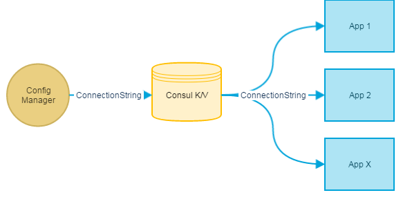

An implementation of [ServiceStack](https://servicestack.net/) [IAppSettings](https://github.com/ServiceStack/ServiceStack/wiki/AppSettings) interface that uses [Consul.io key/value store](https://www.consul.io/docs/agent/http/kv.html) as backing storage.

# Requirements
An accessible running consul agent.

## Local Agent
To get consul.io running locally follow the [Install Consul](https://www.consul.io/intro/getting-started/install.html) guide on the main website. Once this has been installed you can run it with:

```bash
consul.exe agent -dev -advertise="127.0.0.1"
```

This will start Consul running and accessible on http://127.0.0.1:8500.  You should now be able to view the [Consul UI](http://127.0.0.1:8500/ui) to verify. This has a [Key/Value tab](http://127.0.0.1:8500/ui/#/dc1/kv/) where stored keys can be managed.


# Quick Start
The ConsulAppSetting is setup like any other implementation of AppSettings. To set ConsulAppSettings as the default IAppSettings implementation for an AppHost add the following line while configuring an AppHost:

```csharp
public override void Configure(Container container)
{
    // ..standard setup... 
	
    AppSettings = new ConsulAppSettings();
}
```
ConsulAppSettings also works as part of a cascading configuration setup using MultiAppSettings. The following will check Consul first, then local appSetting (app.config/web.config) before finally checking Environment variables.

```csharp
AppSettings = new MultiAppSettings(
    new ConsulAppSettings(),
    new AppSettings(), 
    new EnvironmentVariableSettings());
```

The IAppSetting instances can be auto-wired into services like all other dependencies:

```csharp
public class MyService : Service
{
    public IAppSettings AppSettings { get; set; }
	
	public object Get(KeyRequest key) { ... }
}
```

# Demo
ServiceStack.Configuration.Consul.Demo is a console app that starts a self hosted application that runs as [http://127.0.0.1:8093/](http://127.0.0.1:8093/). This contains a simple service that takes a GET and PUT request:

* GET http://127.0.0.1:8093/keys/all - get all key names
* GET http://127.0.0.1:8093/keys/{key} - get config value with specified key
* PUT http://127.0.0.1:8093/keys/{key}, body: {Body:testtest}, header: content-type=application/jsv - create new config value with specified name and content.

The "Postman Samples" folder contains a sample [Postman](https://www.getpostman.com/) collection containing sample calls. Use the "Import" function in Postman to import this collection, this contains sample PUT and GET requests that can be run against the demo service.

# Why?
When implementing distributed systems it makes life easier to decouple configuration from code and manage it as an external concern. This allows a central place for all shared configuration values which can then be access by a number of systems. It then becomes faster and easier to make configuration changes; an update is made once and can be used everywhere.

For example, if a range of systems need to use the same connection string this can be updated in the central Consul K/V store and is then available to all applications without needing to make any changes to them (e.g. redeploy or bouncing appPools etc):

